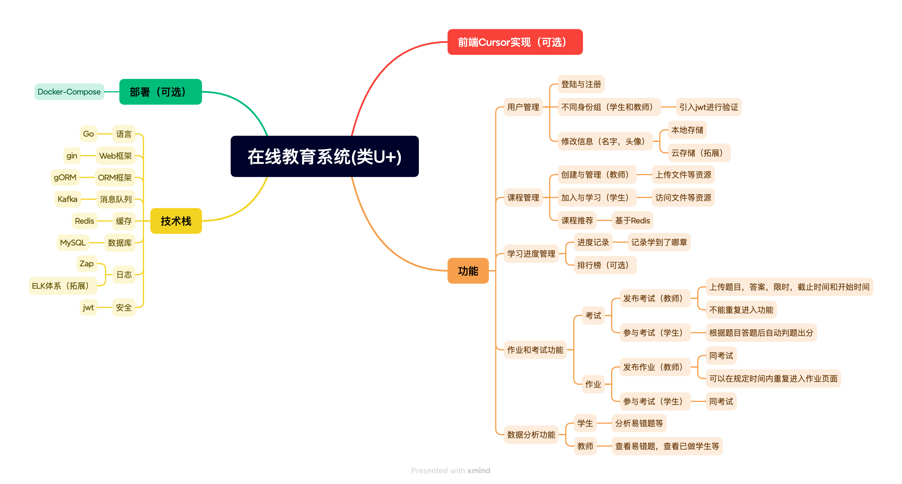

# e-learning-platform
## 前言
欢迎各位发现项目中的错误或者改进点，共同完善项目（感谢）
## 项目简介
### 项目名称
基于gin的在线学习平台（类 U+ 平台）
### 项目目标指向
锻炼Web开发能力
### 项目思维导图

### 项目介绍

本项目是一个面向在线教育场景的综合性管理平台，旨在支持学生与教师两类用户。教师可在平台上创建课程、管理教学资源、布置作业与考试；学生可以加入课程、完成学习任务、查看学习进度等。平台以功能完整性为核心，涵盖用户管理、课程管理、学习记录、数据分析等模块。

### 主要功能模块

1. 用户管理

   * 登录与注册：支持学生与教师的账号注册与登录，并通过 JWT 实现用户身份验证，保障安全。
   * 用户信息管理：用户可以修改个人信息（如头像、姓名等）。

2. 课程管理

   * 课程创建与管理：教师可以创建课程，并上传相关教学资源（支持本地存储或云存储）。
   * 课程加入与学习：学生可通过课程邀请码加入学习，系统根据学生兴趣推荐课程。

3. 学习进度管理

   * 进度记录：平台实时记录学生学习进度（已完成章节、学习时长等），并基于 Redis 提升记录效率。
   * 排行榜（可选）：显示学生学习活跃度、完成任务数等，激励学生持续学习。

4. 作业和考试功能

   * 作业发布与提交：教师可以上传作业，设置提交时间限制；学生按要求提交答案。
   * 考试管理：
     * 教师发布考试，支持添加题目、答案和限制条件（时间、次数等）。
     * 学生完成考试后，系统根据答案自动评分并提供错题统计。

5. 数据分析功能

   * 学生数据分析：
     * 错题分析：帮助教师和学生了解知识薄弱点。
   * 学习轨迹统计：可视化学生学习进程和活跃度。
   * 课程热度分析：通过课程访问量、学习人数等数据，展示课程受欢迎程度。

### 技术架构

1. 后端技术栈

   *	编程语言：Go
   *	框架：Gin（Web 框架）、gORM（数据库 ORM）
   *	数据库：MySQL、Redis（缓存层）
   *	日志管理：Zap（支持结构化日志）
   *	消息队列：Kafka（处理高并发的任务队列）
   *	身份验证：JWT（保证用户登录和操作安全性）
   *	日志分析（扩展）：通过 ELK（Elasticsearch、Logstash、Kibana）体系实现日志的集中管理与可视化分析。

2. 部署方式

   *	Docker-Compose（可选）：提供高效的容器化部署方案，支持服务快速启动与管理。

### 未来扩展方向

* 微服务架构：使用 K8s、gRPC 等技术重构，提升系统灵活性与扩展性。
* 智能化分析：结合 AI 技术，用来判一些主观题目。
* 多端支持：部署到小程序，提供平台支持。